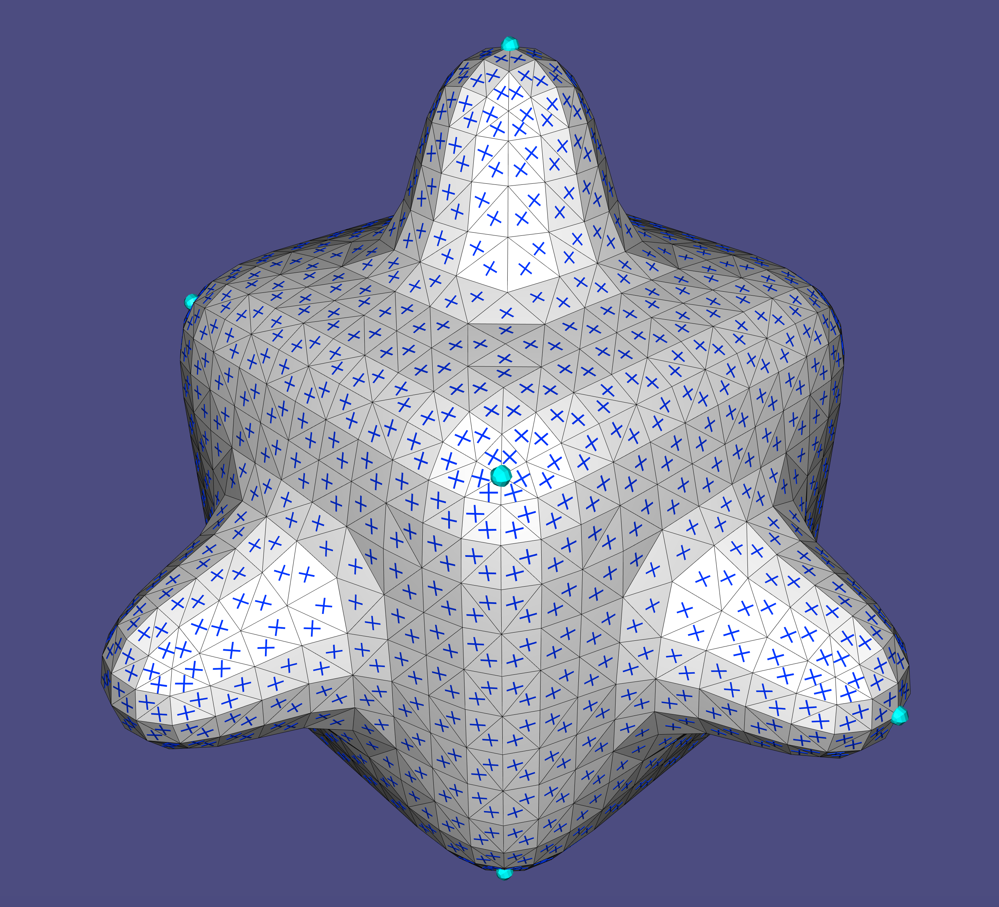
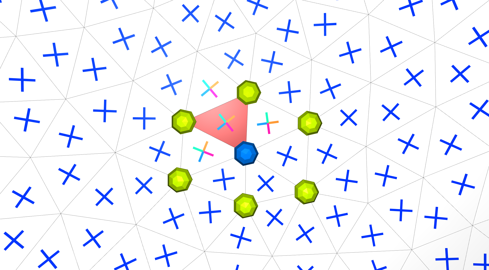
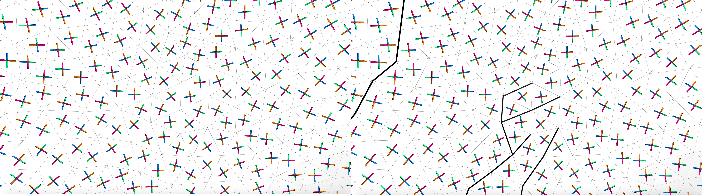
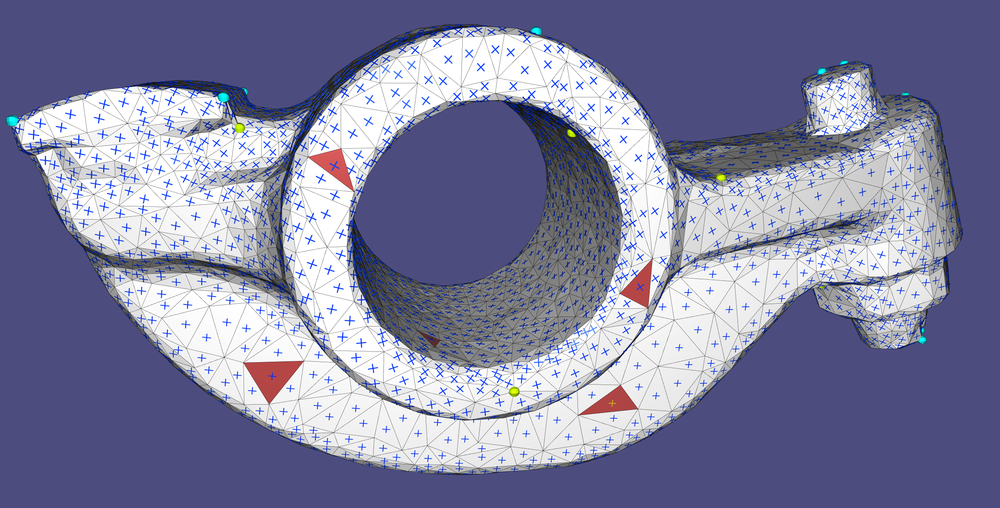
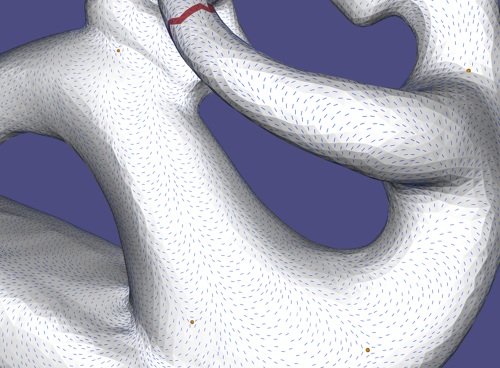

# Directional Tutorial

## Introduction

Directional is a C++ geometry processing library focused on directional-field processing. The functionality is based on the definitions and taxonomy surveyed theoretically in [[Vaxman et al. 2016](#Vaxman2016)] and [[de Goes et al. 2016](#deGoes2016)], and in many newer papers in the literature, cited within context in this tutorial and the code. Directional contains tools to edit, analyze, and visualize directional fields of various degrees, orders, and symmetries.

Discretization in Directional is abstracted by general discrete tangent bundles that can represent a rich class of directional fields. As a result, many of the library's algorithms can now work seamlessly on multiple representations without modification (for example, power fields can be computed on either vertex-based or face-based fields using the same function).
The library comprises two basic elements:

1. Classes representing the basic tangent bundle and field structures. They are built with inheritance so that
   functions can be written polymorphically and consequently algorithms can be applied to several representations that have the minimal set of required properties.

2. Standalone functions, implementing directional-field algorithms, that take these classes as parameters.

3. Algebraic structures, such as cochain complexes. See chapter 6 TODO: link.

Our paradigm avoids buffed classes with a complicated nested hierarchy; instead, the member functions in the classes are minimal, and only used to implement the essential properties of a geometric object (for instance, the connection between tangent spaces). Nevertheless, Directional strives to minimize the number of cumbersome parameters in functions and therefore relies considerably on (passive) data classes aggregating information about specific algorithms.

The library is header only, where each header contains a set of functions closely related (for instance, the precomputation and computation of some directional quantity over a mesh). For the most part, one header contains only one function. The atomic data structures are, for the most part, simple matrices in [Eigen](http://eigen.tuxfamily.org/index.php?title=Main_Page),
The visualization is done through a specialized class `DirectionalViewer`, which is a wrapper around [PolyScope](https://polyscope.run/), with many extended options that facilitate the rendering of directional fields.

The header files contain documentation of the parameters to each function and their required composition; in this tutorial, we mostly tie the functionality of Directional to the theoretical concepts of directional fields and the methods to process and visualize them.

### Installing the tutorial examples

This tutorial comprises an exhaustive set of examples that demonstrate the capabilities of Directional, where every subchapter entails a single concept. The tutorial code can be installed by going into the `tutorial` folder from the main Directional folder, and typing the following instructions in a terminal:

```cpp
mkdir build
cd build
cmake -DCMAKE_BUILD_TYPE=Release ../
make
```

This will build all tutorial chapters in the `bin` folder. The necessary dependencies will be appended and built automatically. To build in Windows, use the `cmake-gui ..` options instead of the last two commands, and create the project using Visual Studio, with the proper tutorial subchapter as the "startup project".

To access a single example, say ``202_Sampling``, go to the ``bin`` subfolder, and the executable will be there. Command-line arguments are never required; the data is read from the ``data`` folder directly for each example. Some examples save output data in the ``output`` folder.

Most examples require a modest amount of user interaction; the GUI should usually be clear on how to do this.

### Discrete tangent bundles

In the continuum, directional fields are represented as elements (formally: *sections*) of tangent spaces, where a tangent space is a linear space attached to each point of a manifold. The set of all such tangent spaces is called a *tangent bundle*. 

In the discrete setting, a tangent bundle is a finite graph $G_{TB} = (V_{TB},E_{TB})$ of tangent spaces. Each tangent space is an independent vector space of dimension $d$. This concept is implemented in the class `TangentBundle`. Discrete tangent bundles supply one or more of the following properties:

1. **Intrinsic parameterization**: vectors in a single tangent space are represented with coordinates $\left(x_1,\cdots,x_d\right)$ in an arbitrary, but fixed basis of dimension $d$. The basis itself does not need to be specified for many algorithms; it can stay abstract.

2. **Adjacency**: a tangent bundle is represented as a graph where the tangent spaces are nodes, and the graph edges are adjacency relations that encode the local environment of any tangent space. This, in fact, encodes the combinatorial and topological structure of the underlying discrete manifold, akin to the smooth structure in the continuum.

3. **Connection**: a connection defines the notion of parallelity in two adjacent tangent spaces, which encodes a metric structure on the underlying manifold, and allows for computing derivatives and curvature. Specifically, a connection is a directed-edge-based quantity on the tangent-bundle graph, given as a change of coordinates between the bases of the source tangent space to the target tangent space. This can be represented as an orthogonal matrix.

4. **metric** The metric on the bundle is supplied in two quantities: ```connectionMass``` is the weight of each edge $E_{TB}$, and ```tangentSpaceMass``` packs the weights of an inner product on vectors on the bundle. That is, it has either $V_{TB}$ or $V_{TB}+E_{TB}$ that are the non-zero components of the vector mass matrix.

5. **Cycles**: $G_{TB}$ can be equipped with a notion of *cycles* $F_{TB}$ that are simply-connected closed chains of spaces. Given a connection, the *holonomy* of a cycle is the failure of a vector to return to itself following a set of parallel transports around the cycle. Concretely, it is encoded in the logarithm of the product of connection matrices. In $d=2$, holonomy, which is then a single angle, is equivalent to the curvature of the cycle modulo $2\pi$. There are two types of cycles, which define the topology of the underlying manifold: *local* cycles (akin to "faces" in $G_{TB}$), which are small closed loops, and *global* cycles, which can be homological generators and boundary loops. The *singularities* of fields are defined on the local cycles.

Oftentimes, the above intrinsic quantities are enough for all algorithms; nevertheless, for reasons of input, output, and visualization, a `TangentBundle` will contain the following, embedding-based extrinsic quantities:

8. **Sources and normals**: point locations and their normals (the codimensional directions of the manifold), which define the tangent planes of the manifold in the Euclidean space. Note that this doesn't mean it's a watertight mesh; that could also encode a point cloud, for instance.

9. **extrinsic to intrinsic and back**: functionality that projects extrinsic vectors into intrinsic space (might lose information), or produces the extrinsic representation of an intrinsic directional object.

10. **Cycles sources and normals**. Like sources and normals, but for the cycles themselves. These quantities mark the locations of the singularities in space, for visualization purposes.

Two main types are currently implemented in directional: `PCFaceTangentBundle` implements face-based tangent spaces for 2D triangle meshes, where the fields are tangent to the natural plane supporting the triangles. `IntrinsicVertexTangentBundle` implements vertex-based intrinsic tangent spaces, which parameterize the cone environment of the $1$-ring directly[^Knoeppel_2013]

For example, this is how `PCFaceTangentBundle` implements the above quantities:

1. Intrinsic parameterization: a local basis in every face.
2. Adjacency: dual (inner) edges between any two faces.
3. Connection: the rotation matrix between the bases of any two adjacent faces.
4. Cycles: the local cycles are around vertex $1$-rings, where singularities are then defined as (dual) vertex values, and global cycles are dual loops of generators and boundaries.
5. Inner product: the natural face-based mass matrix (just a diagonal matrix of face areas).
6. Sources are face barycenters, and normals are just face normals.
7. The projection to the supporting plane of the face and encoding in local coordinates.
8. Vertices and vertex normals (area-weighted from adjacent faces) are the cycle quantities.

Some of the choices above can be varied to different flavors of face-based fields (for instance, the metric culminating in the mass weights). ```PCFaceTangentBundle``` wraps around a an *orientable* input triangle mesh in a *single connected-component*. There are no other limitations on its genus or boundaries. If your input comprises several connected components altogether, you should use several tangent bundles.

### Representation

The representation of a directional field is its encoding in each discrete tangent plane. The most important element is the number of vectors in each tangent plane, which we denote as the *degree* of the field $N$. Currently, Directional supports fields that are represented by explicit (intrinsic) coordinates, which we call a *cartesian field*, and are represented by the class `CartesianField`. Directional currently supports the following variants of Cartesian fields [[Vaxman et al. 2016]](#Vaxman2016).

1. **Raw** - a vector of $d\times N$ entries represents an intrinsic $1^N$-vector (a directional with $N$ independent vectors in each tangent space) in dimension-dominant ordering: $(X_{1,1},\ldots, X_{1,d}),(X_{1,2},\ldots,X_{2,d}),\ldots (X_{N,1},\ldots, X_{N,d})$ per space (for instance, for $d=3$ and $N=4$ it would be $xyzxyzxyzxyz$ ordering with 12 components per tangent space). Vectors are assumed to be ordered in counterclockwise order in most Directional functions that process raw fields. the memory complexity is then $dN|V_{TB}|$ for the entire directional field. A Cartesian Field indicates being a raw field by setting ```CartesianField::fieldType``` to ```directional::RAW_FIELD```.
2. **Power Field** - This is a unique type to $d=2$. It encodes an $N$-rotational-symmetric ($N$-RoSy) object as a single complex number $y=u^N$ relative to the local basis in the tangent space, where the $N$-RoSy is the set of roots $u \cdot e^{\frac{2\pi i k}{N}}, k \in [0,N-1]$. The magnitude is also encoded this way, though it may be neglected in some applications. The memory complexity is then $2|V_{TB}|$.
3. **PolyVector** - Also unique to $d=2$, this is a generalization of power fields that represents an $N$-directional object in a tangent space as the coefficients $a$ of a monic complex polynomial $f(z)=z^N+\sum_{i=0}^{N-1}{a_iz^i}$, which roots $u$ are the encoded $1^N$-vector field. In the case where the field is an $N$-RoSy, all coefficients but $a_0$ are zero. ***Note***: A PolyVector that represents a perfect $N$-RoSy would have all $a_i=0,\ \forall i>0$, but $a_0$ would have the opposite sign from the power-field representation of the same $N$-RoSy. This is since the power field represents $u^N$ directly, whereas a PolyVector represents the coefficients of $z^N-u^N$ in this case. The memory complexity is $2N|V_{TB}|$.

Directional provides a number of conversion functions to switch between different representations. Each of the functions is of the form ```rep1_to_rep2```, where ```rep1``` and ```rep2``` are the representation names in the above list. e.g., ```polyvector_to_raw()```. Some possible combinations are given by composing two functions in sequence. However, note that not every conversion is possible; for instance, it is not possible to convert from PolyVectors to power fields, as they do not possess the same power of expression. Converting into the more explicit raw representation is often needed for I/O and visualization, but not only.

## Chapter 1: I/O and Visualization

### Visualization paradigm

Directional uses a specialized class called `directional::DirectionalViewer` which wraps around `PolyScope`, augmenting it with functionality that pertains to directional fields. A mesh is then stored with its accompanying geometric quantities: the field, edge, vertex, and face-based scalar data, isolines, and more, that we detail in the tutorial per chapter in context. Like PolyScope, Directional supports independent multiple meshes, each with its own set of quantities. The viewer also returns the corresponding PolyScope quantities (for instance, the `PolyScope::SurfaceMesh`), so that one can use the entire functionality of PolyScope independently.

### 101 Glyph Rendering

The most basic operation on directional fields is reading them from a file and drawing them in the most explicit way. In this example, a mesh and a field are read from a file and visualized as follows:

```cpp
directional::readOFF(TUTORIAL_DATA_PATH "/bumpy.off",mesh);
ftb.init(mesh);
directional::read_raw_field(TUTORIAL_DATA_PATH "/bumpy.rawfield", ftb, N, field);
directional::read_singularities(TUTORIAL_DATA_PATH "/bumpy.sings", field);

viewer.init();
viewer.set_surface_mesh(mesh);
viewer.set_cartesian_field(field);
viewer.launch();
```

The field is read in *raw* format (see [File Formats](file_formats.md)), which is detailed in the [Introduction](#introduction). The field is *face-based*, and the singularities are consequently *vertex-based*,

The singularities and glyphs (and most other properties) can be toggled directly from the common PolyScope GUI. The field (and its singularities) are named `field 0` and `singularities 0`, unless a custom name is provided by the user.



<p align=center><em>Glyph Rendering on a mesh with singularities.</em></p>

### 102 Discrete Tangent Bundles

This example shows a Cartesian field computed (with the power-field method described in [Example 301](#301-power-fields)) on either a vertex-based tangent bundle or a face-based tangent bundle. This highlights the flexibility of choosing a discretization. The relevant code segments are:

```cpp
directional::IntrinsicVertexTangentBundle vtb;
directional::PCFaceTangentBundle ftb;

...

void callbackFunc()
{
    ImGui::PushItemWidth(100); // Make ui elements 100 pixels wide,

    if (viewingMode==FACE_FIELD)
        if (ImGui::Button("Toggle Vertex Field"))
            viewingMode=VERTEX_FIELD;

    if (viewingMode==VERTEX_FIELD)
        if (ImGui::Button("Toggle Face Field"))
            viewingMode=FACE_FIELD;

    viewer.toggle_singularities(viewingMode==FACE_FIELD, 0);
    viewer.toggle_singularities(viewingMode==VERTEX_FIELD, 1);
    viewer.toggle_cartesian_field(viewingMode==FACE_FIELD,0);
    viewer.toggle_cartesian_field(viewingMode==VERTEX_FIELD,1);

    ImGui::PopItemWidth();
}

...

directional::readOBJ(TUTORIAL_SHARED_PATH "/elephant.obj", mesh);
viewer.init();
viewer.set_callback(&callbackFunc);
ftb.init(mesh);
vtb.init(mesh);

...

viewer.set_surface_mesh(mesh);
viewer.set_cartesian_field(rawFaceField, "Face-Based Field",  0);
viewer.set_cartesian_field(rawVertexField, "Vertex-Based Field", 1);
viewer.launch();
```

One can see the stages of computing a field: first reading a mesh (`readOBJ()`), then initializing the approxiate tangent bundle with the mesh (`ftb/vtb.init()`), and after computing the fields and converting it to raw format, setting the two fields (with appropriate names and ordinal numbers) to the scene. Note that a visual Cartesian field is a separate entity from a surface mesh; the visual quantities needed for Cartesian field are taken from its inner tangent bundle class (you can infact show the field "floating" without the underlying mesh. `viewer.toggle_X()` functions are used to control what's shown.

 <p align=center><em>Power fields on a face-based tangent bundle (left) and vertex-based (right)</em></p>

### 103 Streamline Tracing

Vector fields on surfaces are commonly visualized by tracing [streamlines] (https://en.wikipedia.org/wiki/Streamlines,_streaklines,_and_pathlines). Directional supports the seeding and tracing of streamlines, for all types of directionals. The seeds for the streamlines are initialized using `DirectionalViewer::init_streamlines()`, and the lines are traced using `DirectionalViewer::streamlines_next()`. Each call to `DirectionalViewer::advance_streamlines()` extends each line by one triangle, allowing interactive rendering of the traced lines. The streamline have the same colors as the initial glyphs, where the colors fade into white as the streamline advance.

<p align=center><em>Tracing the original field (left) into streamlines (right)</em></p>

### 104 Scalar quantities on meshes

It is possible to set and visualize scalar quantities on meshes at different discretization locations: either face based quantities that appear as flat colors per face, vertex-based (pointwise) quantities that interpolate linearly on faces, appearing smooth, and edge-based (integrated) quantities, that appear as flat quantities on a diamond mesh associates with each edge (taking a $\frac{1}{3}$ of the area of each adjacent triangle). The is controlled by the ```DirectionalViewer::set_X_data()``` functions, which also allow the setting of the viewable range of the function (the rest is clipped). The code generating the image below is:

```cpp
    viewer.set_surface_face_data(faceData, "x of normal");
    viewer.set_surface_vertex_data(vertexData, "sin(y)");
    viewer.set_surface_edge_data(edgeData, "principal effort");
```

<p align=center><em>Edge-, Vertex- and face-based data on a mesh, with the field that induced the matching (Chapter 2).</em></p>

### 105 Sparse glyph view

On big meshes, it might appear cumbersome to view *all* glyphs on every face. It is possible to only view the glyphs on a subsample of faces, by using the ```sparsity``` parameter in ```DirectionalViewer::set_cartesian_field()```. This is an integer parameter that controls the density of the sampling, in terms of face distance. Note the setting of the `unitToAvgLengthRatio` parameter, which controls the length of a vector of unit magnitude, relative to the average edge length.

<p align=center><em>Dense (sparsity 0) and Sparse (sparsity 5) views of a field as glyphs</em></p>

### 106 Principal directions

Principal directions, the directions of minimum and maximum normal curvature on a mesh, are important quantities for many applications. They are shown in the example below. The new code part is `viewer.set_raw_field()`, which allows setting a raw field without the entire data structure of a Cartesian field.

<p align=center><em>The minimum (left) and maximum (right) principal directions, computed on the vertices. The respective normal curvatures are color-coded.</em></p>

## Chapter 2: Discretization and Representation

In the following sections, we show some effects of working with different representations and converting between them.

### 201 Principal Matching

One of the fundamental operations in directional-field processing is *matching*. That is, defining which vectors in tangent space $t_i$ correspond to those in adjacent tangent space $t_j$. In Directional, we only work with order-preserving matchings: if vector $k$ in tangent space $t_i$ is matched to vector $m$ in $t_j$, then for any $l \in \mathbb{Z}$, vector $k+l$ is matched to vector $m+l$ (modulo $N$). Suppose that the orientation of the TB graph edge is $t_i \rightarrow t_j$. Then, the matching is encoded as $m-k$. Given a directional field, the matching is sometimes not known in advance (for instance, when the Cartesian field is input or computed), and it needs to be devised from the field.

Given a raw field (in assumed CCW order in every tangent space), and a matching, one defines the (sum of) rotation angles $\delta_{ij}$ (measured against the parallel transport) as the *effort* of the matching. The process of *principal matching* [^diamanti_2014] computes the unique matching of least effort, which is within the range of $[-N\pi, N\pi)$ (and therefore denoted as "principal"). It corresponds to the "smallest angle" matching for $N$-RoSy fields.

Principal matching is done through the function `principal_matching()`, which accepts a Cartesian field as a parameter and computes the following:

1. The matching on each (directed) TB-graph edge. This is stored in the `matching` member of the field class.
2. The indices of the cycles. The singular local cycles are stored in the corresponding `singLocalCycles` and `singIndices` of the field class.

Singularities are computed as the <i>index</i> of each local cycle from the effort around it. The index of a cycle is the sum of efforts around a cycle. A directional must return to itself after a cycle, and therefore, the index is an integer $I$ when a vector $m$ in the face ends up in vector $m+I$. Note that this can also include multiple full rotations (i.e., this is *not* taken modulo $N$), where the index can be unbounded. The *fractional* part of the index is encoded by the matching; however, matching alone cannot encode *integral* indices (for instance, a single vector field has trivial (Zero) matching anywhere, but can have singularities). This is the reason singularity indices are computed from summing up effort and not matching integers. Note that for face-based fields, the singular cycles are vertices, whereas in vertex-based fields, the singular cycles are faces. Further note that Directional computes singularities only around the *local* cycles. That is, `principal_matching()` does not update singularities around boundary or generator loops.

Note that the callback function in this example shows how to pick and select faces on a mesh.

<p align=center><em>A field with singularities is shown, with a selected face illustrating principal matching via colored vectors</em></p>

### 202 Sampling

This is an educational example that demonstrates the loss of information when generating a Cartesian field from rotation angles, and then trying to retrieve them by principal matching. This causes low valence cycles and undersampling causes aliasing in the perceived field. There are three modes seen in the example:

1. **Polar mode**: The user can prescribe the index of a singularity directly, and compute the field with index prescription (see [example 401](#index-prescription)). With this, the rotation angles between adjacent faces can be arbitrarily large, and appear as noise in the low-valence cycles.

2. **Principal-matching mode**: The rotations are reconstructed from the field, without prior knowledge of the prescribed singularity from the polar mode. The large rotations between adjacent faces are aliased, giving rise to a "singularity party": many perceived singularities or a lower index.

3. In the interpolation mode, the field is interpolated from the constrained faces (red) to the free faces (white), keeping the red band fixed from the polar mode. We see a field that is smooth in the Cartesian sense, with more uniformly-placed singularities.

<p align=center><em>Left to right: the polar mode, the principal-matching mode, and the Cartesian mode.</em></p>

### 203 Combing

Given a matching (in this case, principal matching), it is possible to "comb" the field. That is, re-index the vectors in each tangent space (keeping the CCW order), so that the vector indexing aligns perfectly with the matching to the neighbors---then, the new matching on the dual edges becomes trivially zero. This operation is important in order to prepare a directional field for integration. In the presence of singularities, the field can only be combed up to a forest of paths that connect between singularities, also known as *seams*. Note that such paths do not necessarily cut the mesh into a simply-connected patch, but may only connect subgroups of singularities with indices adding up to an integer; as a trivial example, a 1-vector field is always trivially combed, even in the presence of integral singularities, and the set of seams is empty. The combing is done through the function `directional::combing()`. The matching in the output `combedField` is already set to the trivial matching in the combed regions, and the correct matching across the seam.

<p align=center><em>Colored indices of an uncombed field (left), and a combed one (right). Seams are in black</em></p>

## Chapter 3: Cartesian Methods

### Cartesian Fields

The Cartesian representation is a meta-category for representation of vectors in explicit coordinates, either $\left(x,y\right)$ in some local 2D basis on a tangent plane, or $\left(x,y,z\right)$ in the ambient coordinates of the 3D space. The raw, representative (of an $N$-RoSy), power field, and PolyVector representations are all such examples. Cartesian fields often do not automatically contain information about the matching, or rotation, of a field between one face and the next, and it needs to be computed using principal matching. This chapter focuses on computing fields with this representation.

### 301 Power Fields

This representation is offered in [^knoppel_2013], but they did not give it a specific name (the method in general is called "globally optimal"). We use the name "power fields" which is coined in [^azencot_2017]. A power field representation uses a complex basis in each tangent plane of a discrete tangent bundle, and represents an $N$-RoSy using a *power vector*---a single complex number $y$ per face so that its root set $y=u^N$ comprises the vectors of the $N$-RoSy.

By prescribing constraints $y_C$ on a set of tangent spaces $C$, the algorithm interpolates the field to the rest of the spaces $y_I = V_{TB} \setminus y_C$ by minimizing the face-based quadratic Dirichlet energy:

$$Y_I=\text{argmin}\sum_{e=(f,g) \in E_{TB}}{\omega_e\left|Y_fr_{fg}^N - Y_g\right|^2},$$

where $r_{fg} \in \mathbb{C}$ is the connection coefficient between tangent spaces $f$ and $g$, and $\omega_e$ are the connection weights. For instance, in the face-based `PCFaceTangentBundle`,  $r_{fg} = \frac{e_g}{e_f}$, where $e_f$ and  $e_g$ are the normalized edge vectors in their local complex bases, and the weights $\omega_e$ are the harmonic weights as given by [^brandt_2018]. The field is computed through the function `directional::power_field()`. It is possible to softly prescribe the constraints $\left\{Y^*_C\right\}$ with alignment weights $\omega_c$, solving the following minimization problem:

$$y_I=\text{argmin} \left[\sum_{e=(f,g)\in E_{TB}}{\omega_e\left|Y_fr_{fg}^N  - Y_g\right|^2}+\sum_{c \in C}{\omega_c \left|Y_c - Y^*_c\right|^2}\right],$$

where $\omega_c, \forall c\in C$ are user-controlled. The control of soft vs. hard constraints is expressed in this part of the code: 

```cpp
void recompute_field()
{
    directional::power_field(vtb, constVertices, constVectors, Eigen::VectorXd::Constant(constVertices.size(),-1.0), N,powerFieldHard, normalizeField);
    directional::power_field(vtb, constVertices, constVectors, alignWeights, N,powerFieldSoft, normalizeField);
}
```

The `alignWeights` parameter can either express a soft constraint $\omega_c$, or, where it is smaller than zero, it encodes a hard constraint that will be interpolated (it's possible to then mix both hard and soft constraints).

If the set $C$ is empty, the field is only well-defined up to a global rotation; therefore, the algorithm arbitrarily sets a single vector in one tangent space and interpolates it to the rest of the mesh.

<p align=center><em>Hard (left) and soft (right) aligned constraints (yellow on red faces) interpolated to the rest of the mesh. Note the singularities that are discovered through principal matching.</em></p>

### 302 PolyVectors

A Polyvector field [^diamanti_2014] is a generalization of power fields that allows for representing independent vectors in each tangent space, invariant to their order. The representation is as the coefficient set $a_{0 \cdots N-1}$ of a monic complex polynomial in the local complex basis:

$$P(z) = X_0 + X_1z + \ldots + X_{N-1} z^{N-1} + z^N,$$

where the roots $P(z)=0$ are the vectors of the face-based directional object, represented as complex numbers in the local basis. The Dirichlet energy is as for power fields, except with a term for each $X_i$, with the appropriate power $i$. Note that an $N$-RoSy is represented as a polynomial where all $X$'s are zero except $X_0$. Principal matching, combing, and effort are well-defined on PolyVectors as well.

With the function ```polyvector_field()``` one can solve the linear Polyvector problem in its full capacity; the input is a set of prescribed hard constraints $v_b$ per tangent space set $B \subset V_{TB}$, where one can prescribe any number of vectors smaller of equal than $N$ (unless there is symmetry) per tangent space (that means we allow set $C$ to have repeating tangent spaces). Further consider the soft-alignment vectors $v_c$ for face set $c \subset C$, accompanied by an alignment weight $\omega_c$ (again with possibly repeating tangent space). We then solve the following quadratic optimization problem:

$$y_I = \text{argmin} \left(\lambda_S \sum_{n=0}^{N-1}{\sum_{e=(f,g) \in E_{TB}}{\omega_e\left|X_{n,f}r_{fg}^{N-n} - X_{n,g}\right|^2}}\right)+\left(\lambda_R\sum_{n=1}^{N-1}{\sum_{v \in V_{TB}}{w_v\left|X_{n,f}\right|^2}}\right)+\left(\sum_{C,n}{\omega_c\left|X_{n,f}-Q_{c}Q_{c}^{\dagger}(X_{n,f}-q_{c})+q_{c}\right|^2}\right).$$

So that the set $B$ is perfectly interpolated. The matrices $Q_{c}$ and vectors $q_{c}$ are designed to create a linear subspace of polynomials for which the respective vectors $v_c$ are roots; for details see Appendix A in [^Meekes_2021]. $\omega_v$ is the mass of the tangent space (for instance, the area of a face in face-based fields). The last term then measures the soft alignment, also weighted by $\omega_c$ per vector. The same technique is used as a hard reduction for the set $B$. The middle term subdues all non-free powers of $P(z)$, thus optimizing $P(z)$ to be as much a power vector as possible. The different energies are also controlled globally by user parameters $\lambda_S, \lambda_R$ and $\omega_c$. It is also possible to constrain the field to be a perfect power field by setting $\lambda_R=-1$; in fact ```power_field()``` is implemented by calling ```polyvector_field()```. This tutorial examples allows interacting with the alignment weights.

The algorithm is controled by the data structure `PolyVectorData`, with the important following fields:

```cpp
struct PolyVectorData{
public:

    //User parameters
    Eigen::VectorXi constSpaces;    // List of tangent spaces where there are (partial) constraints. The faces can repeat to constrain more vectors
    Eigen::MatrixXd constVectors;   // Corresponding to constSpaces.
    ...
    int N;                          // Degree of field
    const TangentBundle* tb;        //The tangent bundle on which the field is defined
    bool verbose;                   //whether to output anything
    bool signSymmetry;              // Whether field enforces a ssign symmetry (only when N is even, otherwise by default set to false)
    double wSmooth;                 // Weight of smoothness
    double wRoSy;                   // Weight of rotational-symmetry. "-1" means a perfect RoSy field (power field)
    Eigen::VectorXd wAlignment;     // Weight of alignment per each of the constfaces. "-1" means a fixed vector
    ...
};
```

`wSmooth` is $\lambda_S$, `wRosy` is $\lambda_R$, and `wAlignment` is $\omega_c$ (and where it is $-1$ this marks a constraint in $B$). `verbose` should be flagged when output is expected (`false` by default), and `signSymmetry` is flagged when the algorithm should enforce that for every vector $u$ in any single PolyVector in a tangent space, the PolyVector also contains $-u$ (only if $N$ is even); it is `true` by default.

<p align=center><em>Top: Sharp-edge constraints (left; note sometimes more than one per face), Hard (middle) and soft (right) solution. Bottom: dominant-weighted smoothness (left), alignment (middle) and rotational symmetry (right) TODO Replace.</em></p>

**Extension: PolyVector Iterations**: The polyvector algorithm allows for alternate smooth-and-project iterations, which are commonplace in may algorithms CITE. The next two subchapters of Chapter 3 are examples.

### 303 Ginzburg-Landau Fields

We demonstrate how to compute fields that minimize the so-called "Ginzburg-Landau functional":
$$
\int{|\nabla v|^2} + \frac{1}{\epsilon}\int{(|v|^2-1)^2},
$$
for some penalty $\epsilon$ that is assumed to be taken $\epsilon\rightarrow 0$. We employ the common MBO algorithm of repeated iterations of smoothing and renormalization. This introduces the *polyvector iteration* mechanism:

```cpp
//Computing a regular PolyVector field without iterations
    directional::polyvector_field(pvData, pvFieldOrig);
    directional::polyvector_to_raw(pvFieldOrig, rawFieldOrig, N%2==0);
    directional::principal_matching(rawFieldOrig);

    //Iterating for a smoothest perfect-RoSy field
    pvData.iterationMode = true;
    int numIterations = 100;
    std::vector<directional::PvIterationFunction> iterationFunctions;
    iterationFunctions.push_back(directional::hard_rosy);
    directional::polyvector_field(pvData, pvFieldGL);
    directional::polyvector_iterate(pvData, pvFieldGL, iterationFunctions, numIterations);
    directional::polyvector_to_raw(pvFieldGL, rawFieldGL, N%2==0);
    directional::principal_matching(rawFieldGL);
```

The new parts are the function `polyvector_iterate` that runs an iterative algorithm comprising:

1. An implicit step reducing the PolyVector energy.

2. Projection steps controlled by all the `pvIteration` functions in the order they are input.

The basic version is highly configurable, including switching steps (1) and (2), and is controlled by the `PolyVectorData` structure. This includes, for instance, the ability to slow the implicit step (equivalent to playing with $\epsilon$) according to some scheduling. In the GL example, we simply include a project of a polyvector to a perfect RoSy field, using the `hard_rosy()` function.

<p align=center><em>Left: The original PolyVector Fields. Right: After MBO iterations. Note the improved singularity in the zoom-in.</em></p>

### 304 Integrable Fields

This functionality only works with face-based fields via ```IntrinsicFaceTangentBundle```.

Vector-field guided surface parameterization is based on the idea of designing the *candidate* gradients
of the parameterization functions (which are tangent vector fields on the surface) instead of the functions themselves. Thus, vector-set fields ($N$-Rosy, frame fields, and polyvector fields) that are to be used for parameterization (and subsequent remeshing) should be as *integrable* as possible: it should be possible to locally comb them into individual vector fields that are approximately gradients of scalar functions. Fields obtained by "as-smooth-as-possible" design methods (eg. [^ray_2008], [^knoppel_2013], [^diamanti_2014], [^Bommes_2009], [^panozzo_2014]) do not have this property in general. 

In modern methods, this is usually achieved by a smooth-and-reduce-curl approach, which is again doable by the PolyVector Iterations, and using the following projection functions:

```cpp
iterationFunctions.push_back(directional::soft_rosy);  iterationFunctions.push_back(directional::curl_projection);
```

`soft_rosy()` works by only taking the PolyVector part-way towards a perfect RoSy, and `curl_projection()` does principal matching, and then projects out the curl of the field. Following the iterations, the field is by design curl-free numerically, and the `curl_matching()` retrieves it.

<p align=center><em>Left: The original PolyVector Fields. Right: An Integrable field (the curl is color-coded with maximum of 0.09 at yellow).</em></p>

## Chapter 4: Polar Methods

### Polar Fields

Polar fields are represented using angles. These angles may encode the rotation from some given basis on a tangent space (and so it is a "logarithmic" representation, when compared to Cartesian methods), or an angle difference between two neighboring tangent spaces (in the sense of deviation from parallel transport). The former usually requires integer variables for directional-field design. The latter does not, but state-of-the-art methods require the prescription of indices around independent dual cycles in the mesh. Currently, Directional supports the latter.

### 401 Index Prescription

The notion of encoding rotation angles on dual edges, as a means to encode deviation from parallel transport between adjacent tangent planes, appeared in several formats in the literature [[Ray et al. 2008](#Ray2008)]. The formulation and notation we use in Directional is that of Trivial Connections [[Crane et al. 2010](#Crane2010)]. Trivial connection solves for a single rotation angle $\delta_{ij}$ per (dual) edge $e_{ij}$ between two faces $f_i$ and $f_j$, encoding the deviation from parallel transport between them. The algorithm first computes a spanning set of *basis cycles*, around all of which the sum of $\delta_{ij}$ has to be prescribed. The summation is defined as a matrix $H$. Every such cycle (row in the matrix) has an original curvature $K_0$, and the prescribed index defines an alternative curvature that is induced by the vector field (and hence it's a trivial connection). The algorithm solves for the smoothest field, in the 2-norm least squares sense, as follows:

$$
\delta = \text{argmin}\ |\delta_{ij}|^2\ s.t.\ H\delta = -K_0 + K.
$$

$H$ is the matrix that defines the basis-cycles sum, $K_0$ is a vector of the original curvatures of every basis cycle, and $K$ is the prescribed curvatures, which result from prescribed singularity indices: for regular cycles, we prescribe $K=0$, and for a singular cycle with prescribed singularity index $\frac{i}{N}$, we set $K=\frac{2\pi i}{N}$. the sum of $K$ has to conform to the Poincar&eacute; index theorem. However, generator (handle) cycles can admit unbounded indices. See [^crane_2010] for exact details. If the input obeys the sum, the result obeys the prescribed indices around the cycles everywhere. The representation is *differential*, where the single global degree of freedom is resolved by  setting a single direction in a single arbitrary face. Note that the correct definition for "cycle curvature" corresponds to the so-called "cycle holonomy", only up to integer multiples of $2\pi$.

<!---However, in the discrete setting, the curvature should theoretically be computed as the exact discrete angle defect, in which for inner vertices we use $2\pi-\sum{\alpha}$, and for boundary vertices we use $\pi - \sum{\alpha}$ ($\alpha$ are the angles at the corners of a vertex). For a cycle aggregating many vertices, such as a boundary-loop cycle, we add up all the defects. That is required for exact discrete Poincaré index consistency. Note that the boundary indices define how many rotations of the vector field the boundary loop "sees". As an example, a constant field on a simple disc in the plane has indices $0$ for all inner vertices, but the boundary index is in fact $1$---This obeys the total index sum $\chi = 2-2g-b = 2-0-1=1$ ($g$ stands for genus and $b$ for number of boundary loops)-->

#### Basis Cycles

The basis cycles form the cycles around which curvatures (and singularities) have to be prescribed on the mesh. The sum on basis cycles is described in a sparse matrix $H$ of size $|cycles|\times |E_I|$, where $E_I$ is the number of non-boundary (inner) edges in the tangent bundle $G_{TB}$. Each row in the matrix describes the sum over one cycle, and contains $1$ or $-1$ values depending on the (arbitrary) orientation of the dual edge participating in the cycle to the respective face. The types of indices are defined in The [introduction](#discrete-tangent-bundles). The singularity indices that are prescribed contain the singularity index corresponding to each basis cycle. A value of $k \in \mathbb{Z}$ represents an $\frac{2\pi k}{N}$ rotation around the respective cycle. If the prescribed indices do not conform to the Poincar&eacute; index theorem, a result will still be computed by least squares, but it will be unpredictable. The algorithm is performed through the function ```directional::index_prescription()```, which can also accept a solver for precomputation, for the purpose of prefactoring $H$ only once.

<p align=center><em>Indices are prescribed on several vertex singularities, and on a generator loop, to match the index theorem.</em></p>

## Chapter 5: Seamless Integration and Meshing

The full details of the method implemented in this chapter can be found in a technical report [[Vaxman 2021]](#Vaxman2021). Many of the therotical ideas for general $N$-functions are explored in [[Meekes and Vaxman 2021]](#Meekes2021). Moreover, this chapter currently only works with ```IntrinsicFaceTangentBundle```.

$N$-Directional fields are commonly used as candidate gradients to seamless $N$-Functions, which are in turn used to generate meshes that are aligned to the original fields [Bommes et al. 2009](#Bommes2009),[Kaelberer et al. 2007](Kalberer2007),[Myles et al. 2014](#Myles2014). Recall that [combing](#203-combing) trivializes the matching everywhere except a sparse set of seams. We augment these seams so that the mesh is cut into a topological disc. Then, we treat a combed $N$-directional $\left\{u_0,\cdots,u_{N-1} \right\}$ as a set of $N$ candidate gradients for $N$ vertex-based scalar functions $\left\{F_0,\cdots,F_{N-1}\right\}$ on the cut mesh. We proceed by solving the Poisson problem:

$$F = argmin{\sum_{i=0}^{N-1}{\left|\nabla F_i - u_i\right|^2}}$$

Consider a seam edge $e_{ij}$ between original vertices $v_i$ and $v_j$, and between adjacent faces $f_k$ and $f_l$. The two vertices are then cut into four corners $v_{i,k},v_{j,k},v_{i,l},v_{j,l}$. Note that some corners might be identical, if the seam edge is at a singularity. Across the seam edge, we enforce the (linear) seamless conditions:

$$F_{i,k}= \pi_e \cdot F_{i,l}  + T_e,$$

where $\pi_e:N \times N$ is a permutation matrix attached to the (dual) edge $e$, matching values in the integrated function $F$ as it did for the directional field $v$. and $T_e:N \times 1$ is a *translational jump* (also: period jump), that encodes the discontinuity in $F$ across the seam. For quick intuition, this encodes the integration of the function over a loop around the mesh beginning and ending with the seam edge: in a $4$-function, leading to a quad mesh, it is the number of quads in such a loop. If $T_e \in \mathbb{Z}^N$, then the $N$-function is *fully* seamless: the integer isolines of a function connect perfectly along a seam. Otherwise, it is only *permutationally* seamless: the gradients match, which means they are only co-oriented.

Seamless $N$-functions are denoted as such for that obeying the seamless constraints; it can be easily shown [[Kaelberer et al. 2007]](#Kaelberer2007) that the translational jumps $T_e$ is in fact uniform across seam curves between singularities. Thus, the number of such translational jump variables is the number of seam curves in the mesh ($\times N$).

### 501 Seamless Integration

In this example, we demonstrate the computation of such a integration, both permutationally, and fully seamless. The computed function is a $4$-function with sign-symmetry, computing seamless $(U,V,-U,-V)$ functions that we demonstrate as a quad texture. The core functionality is in these lines:

```cpp
directional::IntegrationData intData(N);
...
directional::setup_integration(rawField, intData, meshCut, combedField);
    intData.integralSeamless=false;
    ...
    directional::integrate(combedField, intData, meshCut, cutUVRot ,cornerWholeUV);
    ...
    intData.integralSeamless = true;  
    directional::integrate(combedField,  intData, meshCut, cutUVFull,cornerWholeUV);
```

The data structure containing all relevant information about the integration is ```IntegrationData```. It contains some parameters that can be tuned to control the integration. Several relevant ones are:

```cpp
double lengthRatio;     //global scaling of functions
//Flags
bool integralSeamless;  //Whether to do full translational seamless.
bool roundSeams;        //Whether to round seams or round singularities
bool verbose;           //output the integration log.
```

```lengthRatio``` encodes a global scale for the Poisson problem (scaling the fields uniformly), where the ratio is measured against the bounding box diagonal. Some of the other parameters are demonstrated in the other examples in this chapter. The integrator takes the original (whole) mesh, and generates a cut-mesh (in ```VMeshCut,FMeshCut```) of disc-topology. The singularities are on the boundary of this mesh, and the function can consequently be defined without branching ambiguity on its vertices, with the appropriate permutation and translation across the cut seams.

<p align=center><em>Left: directional field. Center: permutationally-seamless integration. Right: fully-seamless integration.</em></p>

### 502 Integration in various orders

Directional can handle integration for every $N$, including less common ones like the non-periodic $N \neq 2,3,4,6$. The properties of fields and integration in such unconventional $N$ are explored in [[Meekes and Vaxman 2021](#Meekes2021)].

In this example, we demonstrate the results for $N=2,4,7,11$, for the same `lengthRatio`. All are fully seamless. Note that the density of the isolines increases with $N$, and that we round the singularity function values, leading to junctions of multiple isolines meeting.  

<p align=center><em>Left to right: $N=2,4,7,11$. Top: field. Bottom: integer isolines.</em></p>

### 503 Rounding either seams or singularities

It is possible to choose whether to round the seam jumps $T_e \in \mathbb{Z}^N$ directly, or the function values around singularities (and of topological handles, in case of non-simply-connected topology). In both cases, the seams will have integer values, but the latter case is more restrictive and will result in multiple isolines meeting at every singularity. For quad meshes with $N=4$, for instance, this is the difference between pure-quad results (round singularities), or just quad-dominant (round seams).

<p align=center><em>Left to right (bottom is zoom-in of top): Field, rounding only seams (leading to the top singularity being offset), and rounding singularity function values directly.]</em></p>

### 504 Linear Reductions

It is possible to constrain the functions to have linear relations between them, which reduce the degrees of freedom. This is done by inputting a matrix $U: N \times n$ so that $n \leq N$, and where $F = U\cdot f$ for the independent degrees of freedom encoded in $f$. This relationship should be mirrored in the integrated directional field. *Warning*: not every linear reduction is suitable for integration on surfaces! it needs to commute with the permutation around singularities. Feeding an incompatible linear reduction might then result in a failure of the algorithm. One popular example is triangular symmetry where $U_{3 \times 2} = [1, 0; 0, 1; -1, -1]$. Another is sign symmetry where $U = [Id_{n \times n}; -Id_{n \times n}]$, and $n = \frac{N}{2}$. The latter is always assumed when $N$ is even, and both are always valid in any singularity configuration. Symmetries can also be combined. $U$ is fed into ```intData``` through the field ```linRed```, and there are pre-made funtcions to set it, such as ```set_triangular_symmetry(int N)```.

<p align=center><em>Top: A $6$-directional fields with a singularity. Bottom left: $N=6$ only sign symmetry is enforced (the three lines don't always meet at all intersections). Right: the same with added triangular symmetry, where all lines intersect.</em></p>

### 505 Meshing

This subchapter demonstrates how we can create an actual polygonal mesh from the arrangement of isolines on the surface. This creates an arrangement of lines (in exact numbers) on every triangle, and stitches them together across triangles to get a complete conforming mesh. The new mesh is given in the <a href=https://avaxman.github.io/libhedra/>libhedra</a> format of $(V,D,F)$, where $D$ is a vector $|F| \times 1$ of face degrees, and $F$ is a $|F| \times max(D)$ matrix of indices into $V$.

The meshing unit is independent from the integration unit, and can be potentially used with external functions. However, it is easy to pipeline iit with the integration as follows:
```cpp
//setting up mesh data from integration data
directional::MesherData mData;
directional::setup_mesher(meshCut[i], intData, mData);

//meshing and saving
mData.verbose = false;
std::cout<<"Meshing N="<<N[i]<<std::endl;
directional::mesher(meshWhole, mData, VPolyMesh[i], DPolyMesh[i], FPolyMesh[i]);
std::cout<<"Done!"<<std::endl;
```

This reads the integrated information from `intData`. Conversely to previous version, the mesher does not necessarily need an external dependency. Nevertheless, it can optionally be sped up (consdierably) by including <a href=https://gmplib.org/>GMP</a>. This is controlled by CMake within the compilation of the tutorial.

<p align=center><em>Left to right: polygonal meshes of the arrangements of isolines from the N=4,7,11 examples ($N=2$ is not yet supported) in [Example 502](#502-integration-in-various-orders).</em></p>

## Chapter 6: Cochain Complexes

Directional fields, and differential forms, are objects of differential geometry where the underlying manifold is equipped with notions of gradient, curl, divergence, and where gradient fields are curl free and cogradient fields (or just "curl fields") are divergence free. These are special cases of the more abstract algebraic notion of *cochain complexes*. Without going into the full formality, such a complex is defined by a series of spaces $\Omega_i$,  $0 \leq i \leq d$, for some dimension $d$, which are related by differential operators $d_i:\Omega_i\rightarrow \Omega_{i+1}$. These spaces can be equipped with a metric $<>_i:\Omega_i \times \Omega_i \rightarrow \mathbb{R}^{+}$. Essential to the definition is that $d_{i+1}d_i=0$. For instance, scalars to vectors by the gradient operator, and then vectors to scalars (in 2D) by the curl operators comprise a cochain complex. A cochain complex also defines $i^{th}$ singular cohomologies, which are the quotient spaces $H_{i+1}=ker(d_{i+1})/im(d_{i})$. These only arise in case of nontrivial topology, and $|H_i|=\beta_i$ are called the *Betti numbers*, which are in fact generators of the topology. The fields in these spaces are called *harmonic*. The metric also defines a Hodge star $\star_i: \Omega_i\rightarrow\Omega_{d-i}$, which is a duality relation.


**Example**: All gradient fields are curl free, but there are only curl-free fields that are not also gradient in topologies like annuli or tori. the torus has genus $1$ and admits two harmonic fields.

In the discrete setting, the spaces are represented as arrays that represent degrees of freedom in some finite space, the $d$ operators are (often sparse) matrices, and the metrics are implemented as symmetric positive matrices $M$ so that $<a,b>_i = a^TM_ib$. The hodge star is then simply a multiplication by $M_i$. However, it is often that this defines a separate dual structure rather then result in an object of the same space.

Although abstract, the notion has multiple concrete manifestations in directional field processing, which we explore through the chapter’s examples.

### 601 Face-Based Finite Elements

What is called "face-based FEM" is in fact just the structure with face-based vectors depicted in the following figure:
<p align=center><em>Top: the primal cochain complex, taking conforming piecewise linear (PL) functions to face-based piecewise-constant fields, and the curl operator takes the latter to edge-based diamond regions. In the bottom dual structure (right to left), the rotated cogradient of non-conforming piecewise-linear functions are also piecewise-constant fields. their divergence is defined on dual vertex voronoi areas. Going from PL functions to dual regions is done by the mass matrices $M_v$ and $M_e$. The face rotation operator $J$ simply rotates a vector by $\frac{\pi}{2}$ in a face.</em></p>


Which is popular in geometry processing (for instance, studied extensively in [[Wardetzky 2007](#Wardetzky2007)]. This is exemplified in the following code:
```cpp
Eigen::SparseMatrix<double> Gv = directional::conf_gradient_matrix_2D<double>(mesh);
Eigen::SparseMatrix<double> Ge = directional::non_conf_gradient_matrix_2D<double>(mesh);
Eigen::SparseMatrix<double> J =  directional::face_vector_rotation_matrix_2D<double>(mesh);

Eigen::SparseMatrix<double> C = directional::curl_matrix_2D<double>(mesh);
Eigen::SparseMatrix<double> D = directional::div_matrix_2D<double>(mesh);
```
`Ge` is the non-conforming (Edge-based) cogradient, and `J` is the in-face rotation matrix. The code proceeds by verifying the cochain relations (discrete curl of gradient and divergence of rotated cogradient):

```cpp
std::cout<<"max abs curl of exact field (should be numerically zero): "<<(C*Gv*confVec).cwiseAbs().maxCoeff()<<std::endl;
std::cout<<"max abs divergence of coexact field (should be numerically zero): "<<(D*J*Ge*nonConfVec).cwiseAbs().maxCoeff()<<std::endl;
```

<p align=center><em>Left: a conforming PL function with its gradient. Right: a non-conforming PL function with its rotated cogradient.</em></p>

### 602 Discrete Exterior Calculus

### 603 Hodge Decomposition

### 604 Hodge decomposition with boundaries

### 605 Harmonic Fields


<!-- 
A *cochain complex* is defined by a gradient operator $G$ and a curl operator $C$ where $C \cdot G=0$. 

The "cochain" aspect can be purely algebraic and not rely on any explicit nodes in $G_{TB}$; we call $G\cdot f$ for any "scalar" function $f$ *exact* (or *conservative*) fields and fields where $C\cdot v=0$ *closed* (or *curl-free*) fields. 

A cochain complex is enough to define *deRham cohomology* with the correct dimensions $ker(C)/im(G)$. However to extract the explicit harmonic fields we need the next property. 

The combination of a metric and a cochain complex allows for a well-defined notion of *Helmholtz-Hodge decomposition*: any vector field $v$ can be decomposed into exact part $Gf$, coexact part $M^{-1}C^Tg$ and harmonic part $h$ as follows [~boksebeld_2022]:

$$v = Gf + M^{-1}C^Tg + h$$

The inner product also introduces the discrete divergence operator $G^T\cdot M$. Note that the coexact part is divergence free since $G^T\cdot C^T = 0$. The harmonic part $h$ is both.
-->

## Outlook for continuing development

Directional is a an ever-evolving project, and there are many algorithms in the state-of-the-art that we look forward to implement, with the help of volunteer researchers and practitioners from the field. Prominent examples of desired implementations are:

1. Support for 3D fields, particularly *Octahedral* fields [^solomon_2017], both in tet meshes and with the boundary-element method.

2. Support for tensor fields.

3. Higher-order fields.


## References

<a id="Azencot2017"></a>Azencot et al., 2017
: Omri Azencot, Etienne Corman, Mirela Ben-Chen, Maks Ovsjanikov, Consistent Functional Cross Field Design for Mesh Quadrangulation.

<a id="Bommes2009"></a>Bommes et al., 2009
: David Bommes, Henrik Zimmer, Leif Kobbelt, Mixed-integer quadrangulation.

<a id="Bommes2012"></a>Bommes et al., 2012
: David Bommes, Henrik Zimmer, Leif Kobbelt, Practical Mixed-Integer Optimization for Geometry Processing.

<a id="Bouaziz2012"></a>Bouaziz et al., 2012
: Sofien Bouaziz, Mario Deuss, Yuliy Schwartzburg, Thibaut Weise, Mark Pauly, Shape-Up: Shaping Discrete Geometry with Projections.

<a id="Brandt2018"></a>Brandt et al., 2018
: Christopher Brandt, Leonardo Scandolo, Elmar Eisemann, Klaus Hildebrandt, Modeling n-Symmetry Vector Fields using Higher-Order Energies.

<a id="Crane2010"></a>Crane et al., 2010
: Keenan Crane, Mathieu Desbrun, Peter Schröder, Trivial Connections on Discrete Surfaces.

<a id="CignoniMeshlab"></a>Cignoni et al., Meshlab
: Paolo Cignoni, Marco Callieri, Massimiliano Corsini, Matteo Dellepiane, Fabio Ganovelli, Guido Ranzuglia, MeshLab: an Open-Source Mesh Processing Tool.

<a id="Custers2020"></a>Custers & Vaxman, 2020
: Bram Custers, Amir Vaxman, Subdivision Directional Fields.

<a id="Diamanti2014"></a>Diamanti et al., 2014
: Olga Diamanti, Amir Vaxman, Daniele Panozzo, Olga Sorkine-Hornung, Designing N-PolyVector Fields with Complex Polynomials.

<a id="Diamanti2015"></a>Diamanti et al., 2015
: Olga Diamanti, Amir Vaxman, Daniele Panozzo, Olga Sorkine-Hornung, Integrable PolyVector Fields.

<a id="deGoes2016"></a>de Goes et al., 2016
: Fernando de Goes, Mathieu Desbrun, Yiying Tong, Vector Field Processing on Triangle Meshes.

<a id="Kaelberer2007"></a>Kälberer et al., 2007
: Felix Kälberer, Matthias Nieser, Konrad Polthier, QuadCover - Surface Parameterization using Branched Coverings.

<a id="Knoeppel2013"></a>Knöppel et al., 2013
: Felix Knöppel, Keenan Crane, Ulrich Pinkall, Peter Schröder, Globally Optimal Direction Fields.

<a id="Liu2011"></a>Liu et al., 2008
: Yang Liu, Weiwei Xu, Jun Wang, Lifeng Zhu, Baining Guo, Falai Chen, Guoping Wang, General Planar Quadrilateral Mesh Design Using Conjugate Direction Field.

<a id="Myles2014"></a>Myles et al., 2014
: Ashish Myles, Nico Pietroni, Denis Zorin, Robust Field-aligned Global Parametrization.

<a id="Meekes2021"></a>Meekes & Vaxman, 2021
: Merel Meekes, Amir Vaxman, Unconventional Patterns on Surfaces.

<a id="Panozzo2014"></a>Panozzo et al., 2014
: Daniele Panozzo, Enrico Puppo, Marco Tarini, Olga Sorkine-Hornung, Frame Fields: Anisotropic and Non-Orthogonal Cross Fields.

<a id="Ray2008"></a>Ray et al., 2008
: Nicolas Ray, Bruno Vallet, Wan Chiu Li, Bruno Lévy, N-symmetry direction field design.

<a id="Solomon2017"></a>Solomon et al., 2017
: Justin Solomon, Amir Vaxman, David Bommes, Boundary Element Octahedral Fields in Volumes.

<a id="Vaxman2016"></a>Vaxman et al., 2016
: Amir Vaxman, Marcel Campen, Olga Diamanti, Daniele Panozzo, David Bommes, Klaus Hildebrandt, Mirela Ben-Chen, Directional Field Synthesis, Design, and Processing.

<a id="Vaxman2021"></a>Vaxman, 2021
: Amir Vaxman, Directional Technical Reports: Seamless Integration.

<a id="Wardetzky2007"></a>Wardetzky, 2007
: Max Wardetzky, Discrete differential operators on polyhedral surfaces-convergence and approximation.
